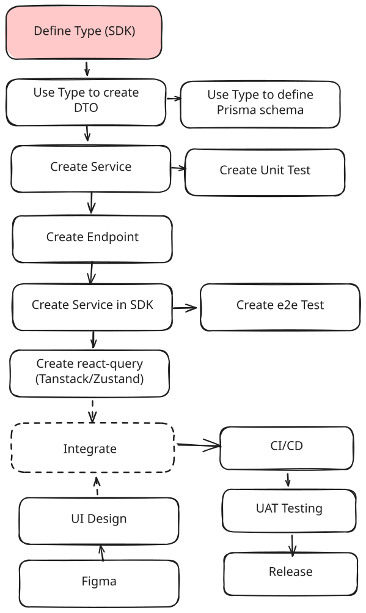

## Development Process

This is how you will write the library


## Quick Commands

```bash
# Install dependencies
pnpm install

# Build everything
pnpm nx run-many -t build

# Run sample app (dev)
pnpm nx serve sample

# Build specific project
pnpm nx build <project-name>

# Test & Lint
pnpm nx test sample
pnpm nx lint sample

# run the production build
pnpm nx run sample:build:production
node dist/apps/sample/main.js
```
